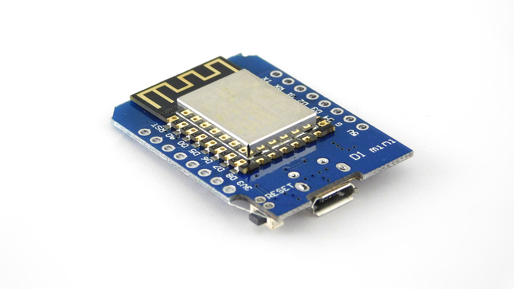
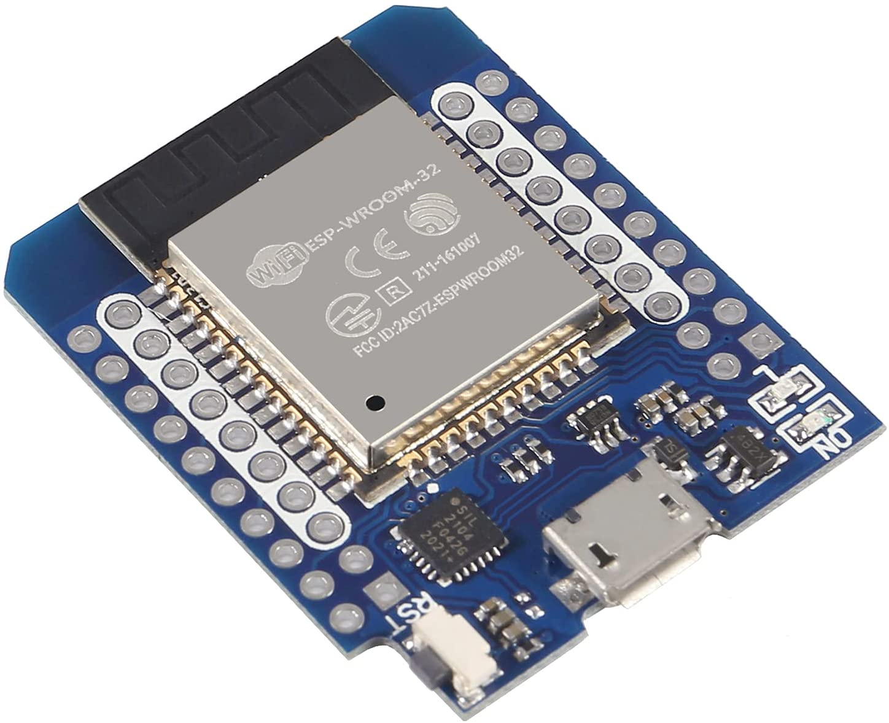

# ESP-TypeScript
<p>
  
  <a href="#" target="_blank">
    
  </a>
  <a href="https://twitter.com/skittleson" target="_blank">
    
  </a>
</p>

> Transpile TypeScript to JavaScript for ESP8266/ESP32 microcontrollers template project. Writing safe, maintainable, and testable code is the projects goal.

## Install

```sh
npm install
```

## Usage

Adjust port used in `package.json` then:

```sh
npm run-script transpile
```

Monitor serial responses

```sh
npm run-script monitor
```

## Run tests

```sh
npm test
```

## Example

The simplest example in `blinky.ts`. Blink a LED.

```typescript
const BUILTIN_LED = 2;
export function blinkly(intervalMs: number = 2000, pin: number = BUILTIN_LED) {
  let toggleStatus = false;
  setInterval(function () {
    toggleStatus = !toggleStatus;
    digitalWrite(pin, toggleStatus);
  }, intervalMs);
}
```

More advance example using a class, properties, and type checking:  `AdvanceBlinky` class in `blinky.ts`.

## Road map

- [x] Transpile TypeScript to Espruino flavor of JavaScript
- [x] Example usage of typed code
- [x] Short commands to build, upload, and monitor
- [x] Unit testing
- [ ] Integration testing
- [ ] Firmware guidance docs


## Devices

ESP8266

[](https://amzn.to/3vA67By)


ESP32
[](https://amzn.to/3Ml7Znx)


These devices are also know to work: https://templates.blakadder.com/


## Author

👤 **Spencer Kittleson**

* Website: https://docodethatmatters.com
* Twitter: [@skittleson](https://twitter.com/skittleson)
* Github: [@skittleson](https://github.com/skittleson)
* LinkedIn: [@skittleson](https://linkedin.com/in/skittleson)

## Show your support

Give a ⭐️ if this project helped you!

